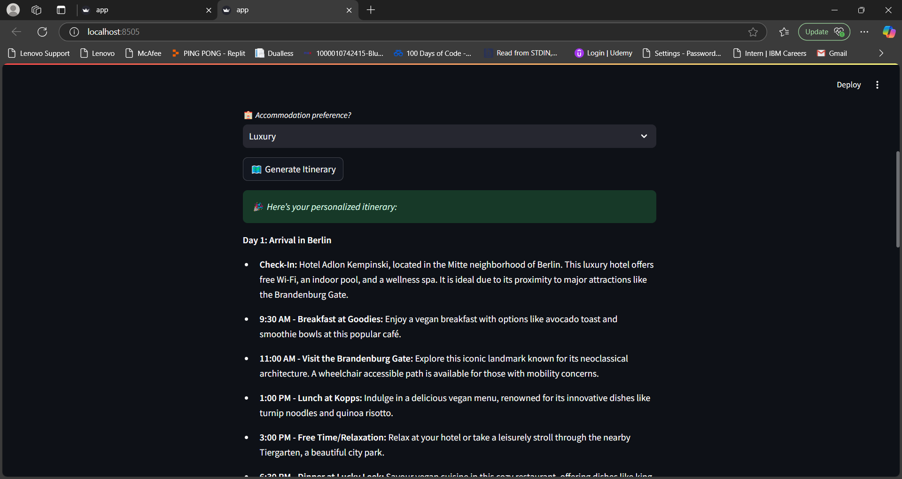
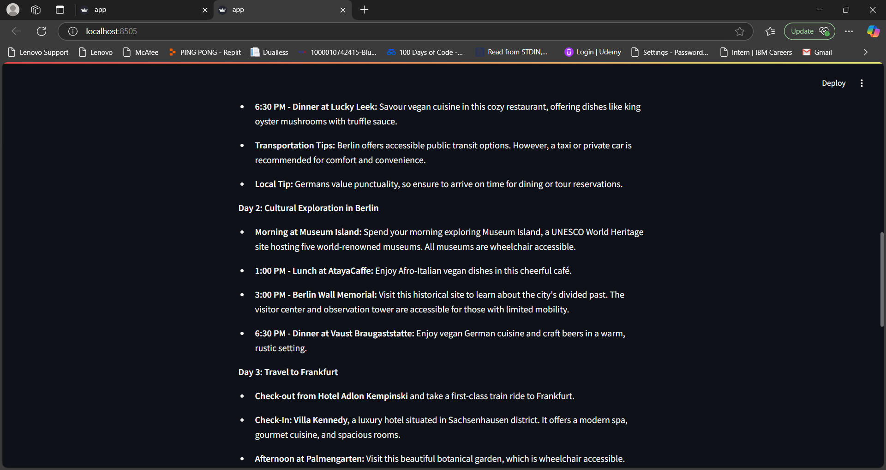
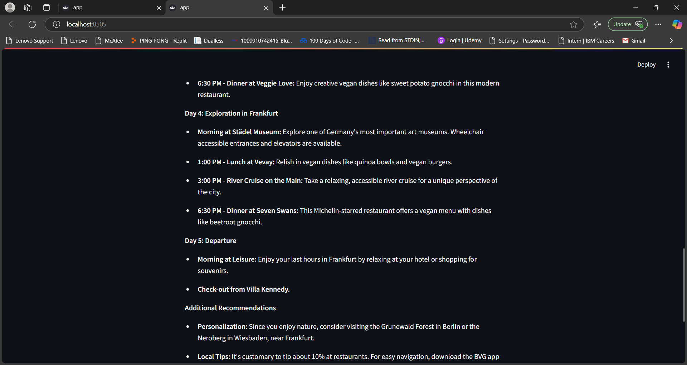

<h1><u>Project Title: AI Travel Planner</u></h1>

<h2>Overview</h2>

The AI Travel Planner is a web-based application that generates personalized day-by-day travel itineraries based on user inputs such as destination, duration, budget, and preferences. The app is built using Streamlit for the front end and OpenAI's API for generating itineraries.

<h2><u>Deliverables</u></h2>

<h2><u> Process Documentation</u></h2>
<li>
  <ol>Basic User Input: The app starts by collecting essential trip details (e.g., destination, duration, budget, and preferences). If any mandatory field is missing, the user is prompted to complete it.</ol>
</li>
