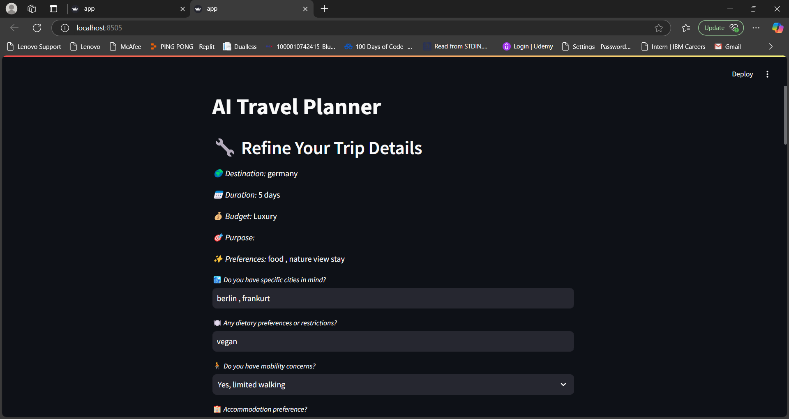

<h1><u>Project Title: AI Travel Planner</u></h1>

<h2>Overview</h2>

The AI Travel Planner is a web-based application that generates personalized day-by-day travel itineraries based on user inputs such as destination, duration, budget, and preferences. The app is built using Streamlit for the front end and OpenAI's API for generating itineraries.

<h2><u>Deliverables</u></h2>

<h2><u> Process Documentation</u></h2>
<ul>
<li>
  <ol>Basic User Input: The app starts by collecting essential trip details (e.g., destination, duration, budget, and preferences). If any mandatory field is missing, the user is prompted to complete it.</ol>
  <ol>Refinement: Users can provide additional details like specific cities, dietary restrictions, and mobility concerns. This ensures a more tailored itinerary.</ol>
  <ol>Itinerary Generation: The refined inputs are passed to OpenAI's API to create a detailed itinerary. The app handles potential errors and provides feedback in case of issues.</ol>
</li>
</ul>

<h2><u>Hosted Application</u></h2>

The application has been deployed on Streamlit. 

<h2>Conclusion</h2>

The AI Travel Planner offers a seamless experience for users by combining dynamic input handling, refined prompts, and live deployment. Its flexibility in processing varied input formats and providing tailored outputs sets it apart as a robust travel planning tool.

